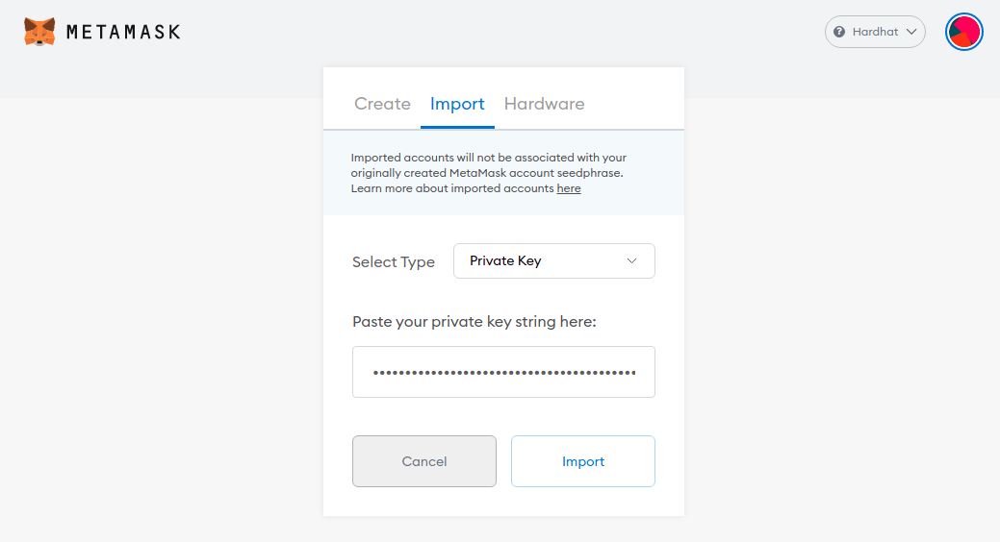

# Installation

In a terminal window, run
```
git clone https://github.com/solace-fi/solace-core.git
git clone https://github.com/solace-fi/solace-client.git
cd solace-core
npm i
npx hardhat compile
cd ../solace-client
npm i
cp -r ../solace-core/client/. .
npm run start
```

The client should pop up in a new browser window, if not go to http://localhost:3000/

You will need to connect to the Hardhat network and import accounts with ETH on Hardhat to interact with the client.  

1: Install and open the metamask chrome extension  


2: Ethereum Mainnet -> Custom RPC  
  

3: Create a network with these settings
  

4: Accounts -> Import Account
  

Import an account for each of these private keys:  
Hardhat Account 1: `0xac0974bec39a17e36ba4a6b4d238ff944bacb478cbed5efcae784d7bf4f2ff80`  
Hardhat Account 2: `0x59c6995e998f97a5a0044966f0945389dc9e86dae88c7a8412f4603b6b78690d`  


Return to the client at http://localhost:3000/

