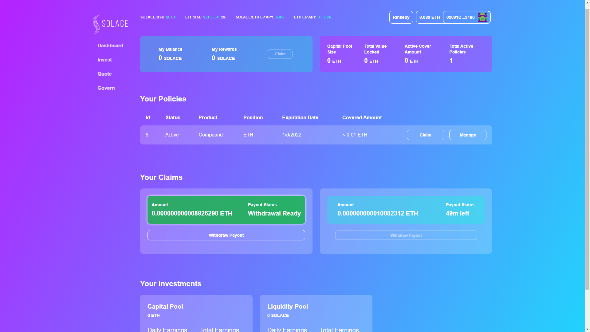
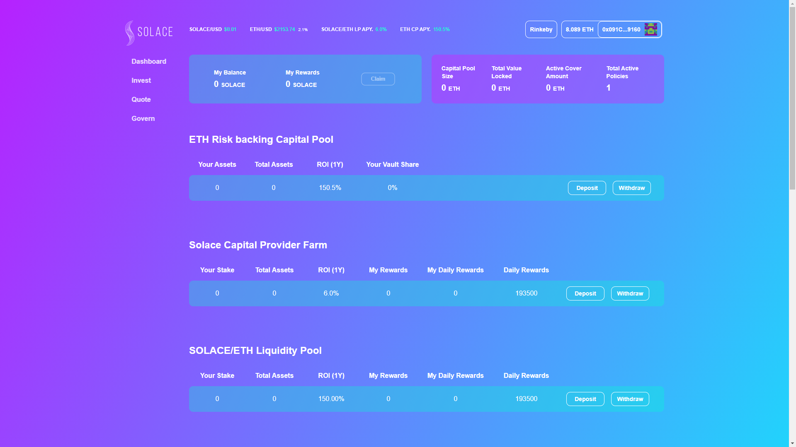
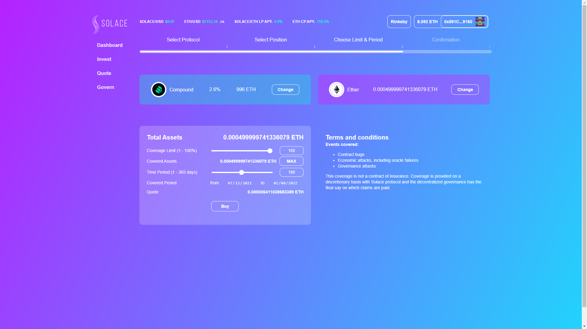
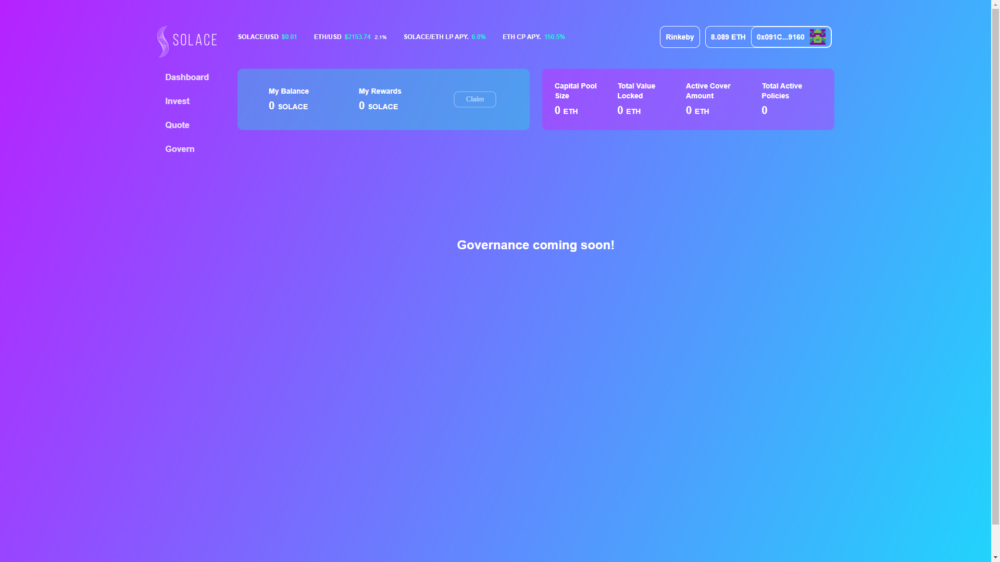
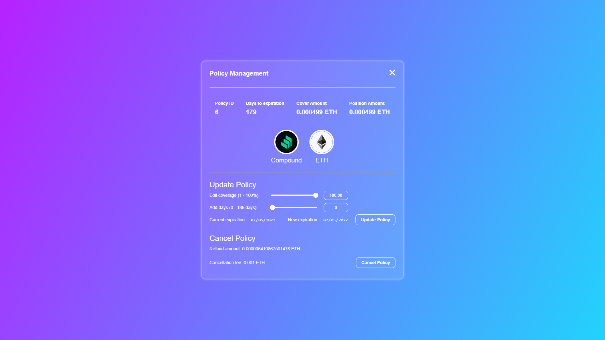
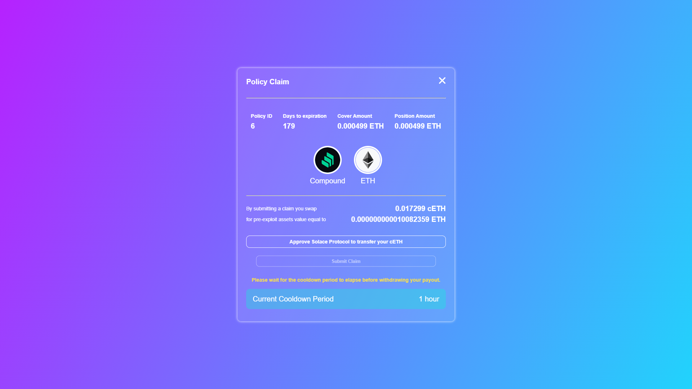

# client

### The solace.fi web interface

## Where do I start reading through this code?

---

Start with src/index, it's the entry point.

## How to start testing locally

---

Note: This project was originally developed alongside the Hardhat framework.

Install dependencies

    npm install

Run the following commands from the core directory

    npx hardhat compile
    npx hardhat node

In a different terminal, run the following commands from the core directory

    npx hardhat run --network localhost scripts/deploy.ts

After the deploy script is ran, copy the output of REACT_APP contract addresses into the .env file of the client directory

    Registry       | <1>
    Master         | <2>
    Vault          | <3>
    CpFarm         | <4>
    UniswapFactory | <5>
    UniswapRouter  | <6>
    UniswapLpToken | <7>
    UniswapPool    | <8>
    LpFarm         | <9>
    Treasury       | <10>
    ClaimsEscrow   | <11>
    ClaimsAdjustor | <12>
    ...

    REACT_APP_REGISTRY_CONTRACT_ADDRESS=<1>
    REACT_APP_SOLACE_CONTRACT_ADDRESS=<2>
    REACT_APP_WETH_CONTRACT_ADDRESS=<3>
    REACT_APP_MASTER_CONTRACT_ADDRESS=<4>
    REACT_APP_CPFARM_CONTRACT_ADDRESS=<5>
    REACT_APP_LPFARM_CONTRACT_ADDRESS=<6>
    REACT_APP_VAULT_CONTRACT_ADDRESS=<7>
    REACT_APP_TREASURY_CONTRACT_ADDRESS=<8>
    REACT_APP_CLAIMS_ESCROW_CONTRACT_ADDRESS=<9>
    REACT_APP_CLAIMS_ADJUSTOR_CONTRACT_ADDRESS=<10>
    REACT_APP_UNISWAP_FACTORY_CONTRACT_ADDRESS=<11>
    REACT_APP_UNISWAP_ROUTER_CONTRACT_ADDRESS=<12>
    REACT_APP_UNISWAP_LPTOKEN_CONTRACT_ADDRESS=<...>
    REACT_APP_UNISWAP_POOL_CONTRACT_ADDRESS=<...>
    REACT_APP_POLICY_MANAGER_CONTRACT_ADDRESS=<...>
    REACT_APP_COMPOUND_PRODUCT_CONTRACT_ADDRESS=<...>

Run using the following react command from the client directory

    npm start

## Project Structure

    src/
    |___components/
    |___constants/
    |   |____abi/
    |___context/
    |   |____ContractsManager
    |   |____NotificationssManager
    |   |____ProviderManager
    |   |____UserDataManager
    |   |____WalletManager
    |___wallet/
    |   |____connectors/
    |   |____wallets/
    |___hooks/
    |___pages/
    |   |____dashboard/
    |   |____govern/
    |   |____invest/
    |   |____quote/
    |   |____App
    |___static/
    |___styles/
    |___utils/

## React Context Structure

    <ProviderManager>              // Web3 Provider
      <WalletManager>              // wallet connection
        <ContractsManager>         // contracts
          <UserDataManager>        // user-specific data
            <NotificationsManager> // notifications and toasts
              ...
                <App />
              ...
            </NotificationsManager>
          </UserDataManager>
        </ContractsManager>
      </WalletManager>
    </ProviderManager>

WalletManager allows access to web3-react, wallet connection functionalities, and wallet balance.

ContractsManager allows centralized access to contracts.

We may need more Context providers in the future, for data such as themes and user preferences.

## Design Decisions

There are two git repositories that influenced this application design direction, [Barnbridge](https://github.com/BarnBridge/barnbridge-frontend)
and [Uniswap](https://github.com/Uniswap/uniswap-interface).

At the time of writing, Barnbridge utilized Web3 and React Context, while Uniswap utilized Redux and Ethers, but they both used Web3-react. To make the most of our application, we tried to get the best of both worlds using the following stack: React Context, Ethers, and Web3-React.

There was also a difference in the organization of connectors and contracts observed in both repositories. Barnbridge centralized all of its contracts into a single Context provider, while Uniswap centralized contract hooks and molded its contract functions into hooks that are called by different components of the application. This application was able to mesh the two types of organizations together.

## User Journeys

### Connecting and disconnecting wallet

Upon starting the application, the Context provider that manages Web3 keeps track of what provider is available. Whether the user selects a provider or not, it is saved locally onto the user's browser. The provider, or the lack of, is then propagated throughout the application.

### Contract function calls

During development, contract functions are implemented to communicate between the smart contract and the frontend. So far, the most basic view and mutable methods work, although needs fine tuning in the future.

### Changing between pages

The application uses a HashRouter that will display different components or pages to the user based on the URL.
